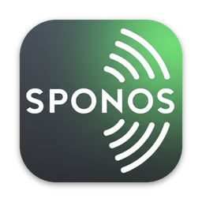

# Sponos

A fast desktop controller for Sonos speakers on macOS, with Spotify search and queueing.

- Queue with drag to reorder, play next / add to end
- Spotify search (songs, albums, artists, playlists) and your own library after logging in
- Mini player and menu bar controls
- Floorplan overview: place speakers on a plan, see what's playing, group rooms by dragging
- Multiple Sonos systems (e.g. office and home): it switches automatically, and each system has its own floorplan
- Classic and glass themes

## Install

**[Download Sponos.dmg](https://github.com/casperjuel/sonos-ui/releases/latest/download/Sponos.dmg)**, open it and drag **Sponos** to Applications.

If macOS says the app can't be opened, go to System Settings → Privacy & Security, scroll down and click **Open Anyway**. You only need to do this once.

**Requirements**
- Sonos speakers on the same network, with Spotify linked to the Sonos system in the Sonos app. You don't need the Sonos app after that.
- Log in with your own Spotify account in the app. The built-in Spotify app is in development mode, which allows 5 users. Each user's Spotify email must be added under User Management at <https://developer.spotify.com/dashboard>. Past 5 users, people can create their own Spotify app and paste its client ID under Settings → Advanced.
- Songs play through the Spotify account linked in Sonos. Your login is used for search, your playlists and your liked songs.

## Develop

```bash
pnpm install
pnpm tauri dev
```

## Release

Releases use [release-please](https://github.com/googleapis/release-please). Write [conventional commits](https://www.conventionalcommits.org) (`feat: …`, `fix: …`) on `main`, and release-please keeps a "release vX.Y.Z" pull request up to date. Merging that PR tags the release. GitHub Actions then builds a universal (Apple Silicon + Intel) app and attaches it as `Sponos.dmg`. The download link above always points at the newest release.

The Spotify client ID is compiled in. Set the repository variable `SPOTIFY_CLIENT_ID` to use a different one. No secret is needed, because login uses PKCE.

### Signing and notarization

Without Apple secrets, the app gets an ad-hoc signature. It runs, but colleagues have to click "Open Anyway" once. To sign with a Developer ID and notarize, add these repository secrets:

| secret | value |
|---|---|
| `APPLE_CERTIFICATE` | base64 of the exported Developer ID Application `.p12` (`base64 -i cert.p12 \| pbcopy`) |
| `APPLE_CERTIFICATE_PASSWORD` | the `.p12` export password |
| `APPLE_SIGNING_IDENTITY` | e.g. `Developer ID Application: Your Name (TEAMID)` |
| `APPLE_ID` | your Apple ID email |
| `APPLE_PASSWORD` | an app-specific password from <https://account.apple.com> |
| `APPLE_TEAM_ID` | your 10-character team ID |

## How it works

**Sonos.** Everything talks to the speakers' local UPnP/SOAP API on port 1400 (`src-tauri/src/sonos.rs`).
- Discovery uses SSDP. If the firewall blocks it, it falls back to the speaker IPs in Settings. One reachable speaker is enough, because `ZoneGroupTopology` lists the rest.
- Each system is identified by its household ID, so the app knows when you've moved between networks.
- State is **polled** every second rather than subscribed to. Subscribing needs UPnP eventing, which requires inbound HTTP, and the macOS firewall often blocks that.
- Commands always go to the **group coordinator**.

**Spotify.** Search and library use the Spotify Web API (`src-tauri/src/spotify.rs`). Login uses PKCE with a built-in client ID, so no secret ships with the app.

A result is enqueued on Sonos with `AddURIToQueue`, using a Sonos-specific URI and DIDL-Lite metadata:

| kind     | URI                                                                 |
|----------|---------------------------------------------------------------------|
| track    | `x-sonos-spotify:spotify%3atrack%3a<id>?sid=9&flags=8232&sn=34`      |
| album    | `x-rincon-cpcontainer:1004206cspotify%3aalbum%3a<id>?sid=9&flags=8300&sn=34` |
| playlist | `x-rincon-cpcontainer:1006206cspotify%3aplaylist%3a<id>?…`           |
| artist   | `x-rincon-cpcontainer:100e206cspotify%3aartistTopTracks%3a<id>?…`    |

`sid` (service ID) and `sn` (account slot) differ between households. The app reads them from existing Spotify items in the Sonos favourites or queue. You can override them in Settings.

## Live test (read-only)

```bash
SONOS_IP=<speaker ip> cargo test --manifest-path src-tauri/Cargo.toml --lib -- --ignored --nocapture
```
